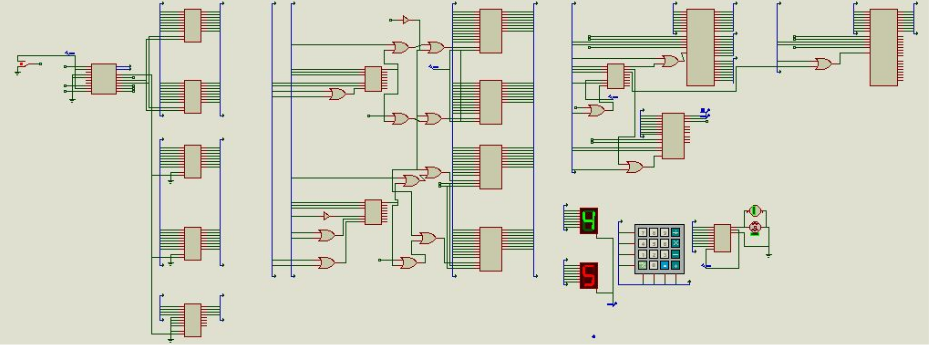
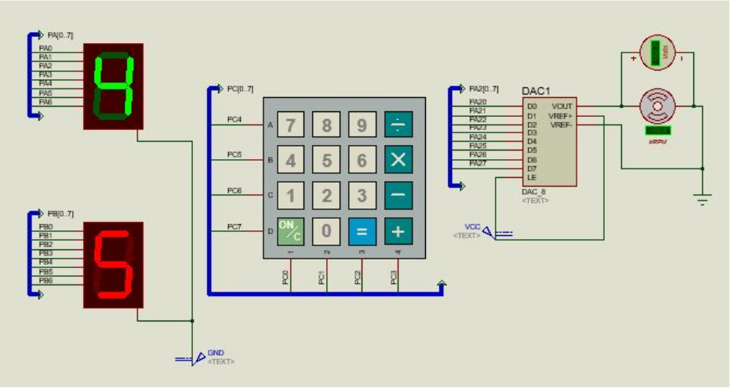
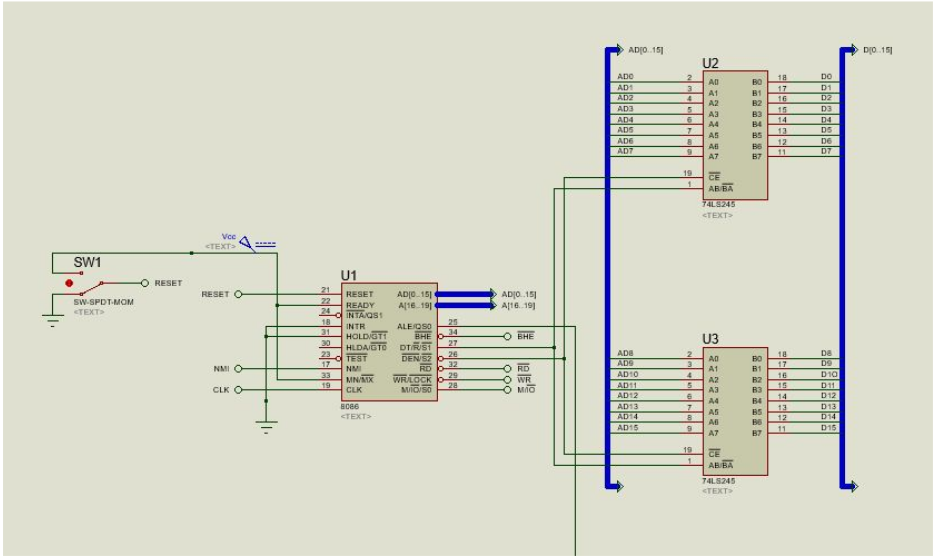

## Fan Control System

Our submission for the Design Project component of the **Microprocessors and Interfacing** course at BITS Pilani.
  
### Problem Statement
This system senses the speed at which the fan is rotating and adjusts the speed, based on
the user input. The user can select three different speeds of the fan. The current speed
should be sensed and the control mechanism should gradually increase the speed to the
desired speed.

### Circuit Diagrams

### Specifications and Assumptions
- The 5 different speeds of the DC motor correspond to applying approximately 1V, 2V, 3V, 4V and 5V difference across its terminals (subject to resolution error of DAC).
- The user can enter hour between 1  to 9 (both inclusive) for auto mode. While simulating in Proteus, the time is scaled down to 10 seconds (i.e. auto mode on 5 will cause the fan to shutdown in 50 seconds rather than 5 hours). In real system, the counter value fed into 8253 can be changed to adjust accordingly. Alternatively, the clock frequency in to CLK0 of 8253 used can be changed.
- Green colored 7 segment display shows the speed of the fan, while the red one shows the status of the auto mode
- The user flow is like this:
  - User powers on the circuitry, and waits for initialization of the system, completed when both the displays show ‘-’ on the display (setting up ports, clock etc)
  - User enters ‘1’ - ‘5’, corresponding to the initial speed of the fan.
  - User presses ‘ON/C’ button on the keypad to turn on the fan.
  - User can press ‘+’ to increase the speed of the fan, and ‘-’ to decrease the speed of the fan. Once started, the user cannot directly jump to any arbitrary speed of the fan by using the numpad.
  - To setup auto mode, user presses ‘=’ key. The red display switches from ‘-’ to ‘A’, displaying that auto mode is ready to be setup. User presses ‘1’ - ‘9’ to signify the number of hours (or the number of 10 seconds, in simulation) after which the fan must be turned off. (NOTE: During this whole process, the user can press ‘X’ key on the keypad to cancel the Auto mode setup process, however once setup, Auto mode cannot be cancelled). After finalizing the time requirement, the user is to press ‘=’ again to set the auto mode into motion. The fan will shutdown after the desired time.
  - During the above whole process, the user can press ‘ON/C’ to manually shutdown the fan. (NOTE: User can shutdown the fan in between auto mode, without any side effects).
- Initial address executed by 8086 is 0x00000 (as opposed to 0xFFFF0 in real microprocessor).
- Only 8 bit addresses are being decoded for I/O space, as is done in most of the dedicated circuits. Therefore, we are assuming that in the future, the system won’t grow much complex (that 16 bit addresses needed for decoding I/O devices).

### Team
Laksh Singla  
Aditya Upadhyaya  
Aniruddha Karajgi  
Pratik Kakade
